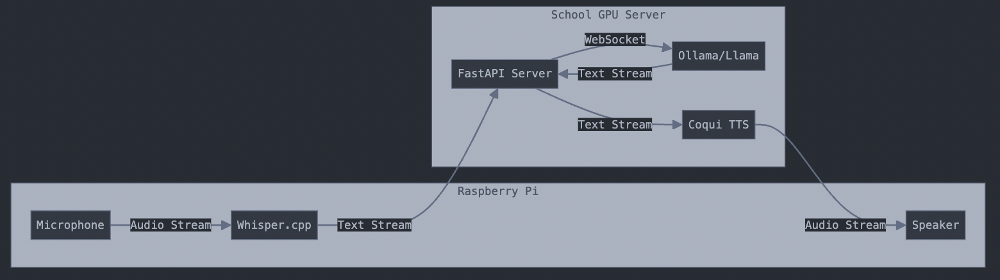
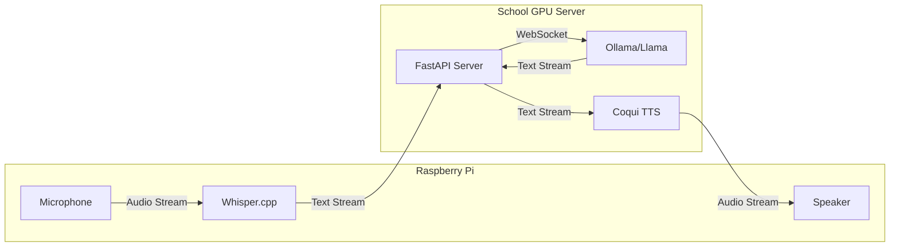

# Claude Architecture





## Tools and Implementation

Here are the recommended tools and implementation approach:

### 1.  **Speech-to-Text (On Raspberry Pi)**:

-   Use `whisper.cpp` for real-time speech recognition
-   It's lightweight, optimized for ARM processors, and can run efficiently on Raspberry Pi
-   Python bindings are available via `whisper-cpp-python`

### 2.  **Communication Layer**:
    -   Use `FastAPI` with WebSocket support for bidirectional streaming
    -   `websockets` library for Python WebSocket client on the Raspberry Pi
    -   This enables real-time streaming of both text and audio

### 3.  **LLM Interface (GPU Server)**:
    -   Use Ollama's Python SDK for streaming interface
    -   Connect via WebSocket to enable streaming responses

### 4.  **Text-to-Speech (GPU Server)**:
    -   Use Coqui TTS (formerly Mozilla TTS) for high-quality speech synthesis
    -   It can run efficiently on the GPU
    -   Supports streaming audio output

Key features of this implementation:

### ### 1.  **Streaming Audio Processing**:
    -   Uses `sounddevice` for real-time audio capture
    -   Processes audio in chunks for immediate response
    -   Streams both input and output audio

### 2.  **WebSocket Communication**:
    -   Maintains persistent connection between Pi and GPU server
    -   Enables bidirectional streaming of text and audio
    -   Low latency for real-time conversation

### 3.  **Asynchronous Design**:
    -   Uses `asyncio` for non-blocking I/O
    -   Handles multiple concurrent operations efficiently
    -   Maintains responsive user experience

## Python Library Installation

To implement this system:

### On the Raspberry Pi:

```sh
pip install whisper-cpp-python websockets sounddevice numpy
```

### On the GPU Server:

```sh
pip install fastapi uvicorn TTS ollama websockets
```

The system is designed to be modular, so you can easily:

-   Swap out components (e.g., different TTS engines)
-   Add new features (e.g., emotion detection)
-   Scale to multiple robots
-   Monitor and log interactions

## Code on the Pi

```python
# raspberry_pi/main.py
import asyncio
import websockets
import sounddevice as sd
import numpy as np
from whisper_cpp import Whisper
class RobotClient:
def __init__(self):
self.whisper = Whisper("base.en")
self.sample_rate = 16000
self.ws = None
async def process_audio_stream(self, indata, frames, time, status):
if status:
print(status)

# Process audio chunk with Whisper
text = self.whisper.transcribe(indata)
if text.strip():
# Send to server
await self.ws.send(text)
async def start_streaming(self):
self.ws = await websockets.connect('ws://gpu-server:8000/chat')

# Start audio streaming
with sd.InputStream(callback=self.process_audio_stream,
channels=1,
samplerate=self.sample_rate):
while True:
# Receive audio response from server
audio_data = await self.ws.recv()
# Play audio
sd.play(audio_data, self.sample_rate)
sd.wait()
```